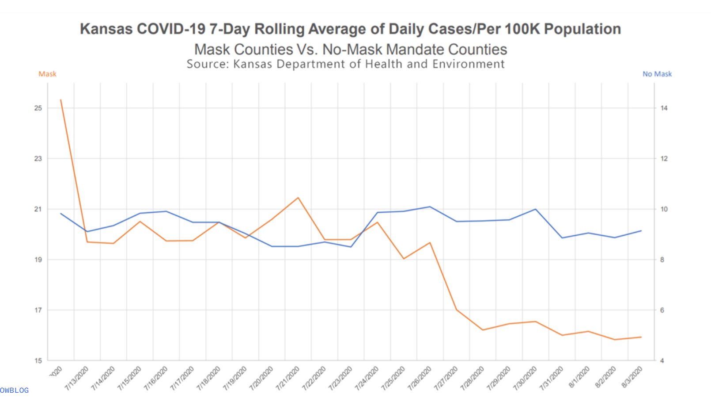

```{r setup, include=FALSE}
knitr::opts_chunk$set(eval = TRUE)
```

## Introduction

In this lab our goal is to reconstruct and improve a data visualization about COVID-19 and mask wearing. You'll see how the same data can tell very different stories depending on how it's visualized.

**This is a short, focused lab** where you'll practice critical thinking about data visualization.

**Estimated time:** 45-60 minutes

## Learning Goals

By the end of this lab, you will be able to:

- Critique visualizations that misrepresent data
- Identify misleading elements in data visualizations
- Create data frames manually using `tribble()`
- Improve data visualizations to better convey accurate information
- Make design choices that enhance honesty and clarity

## Prerequisites

Before you begin, make sure you have:

- ✅ Completed Labs 01-08
- ✅ Reviewed lectures on data visualization best practices
- ✅ Understand principles of honest data representation
- ✅ Forked the lab-instructions repository

---

# Getting Started

Navigate to your forked `lab-instructions` repository in JupyterHub, open the `Lab09` folder, and open the R Markdown document `lab-09.Rmd`.

## Verify Your Setup

Before proceeding:

Step 1. Open `lab-09.Rmd` in RStudio

Step 2. Check that the Git pane shows YOUR username (not the course organization)

Step 3. Click **Knit** to make sure the document compiles

## Warm Up

**Step 1:** Update the YAML, changing the author name to your name.

**Step 2:** Knit the document.

**Step 3:** Commit your changes with message "Updated author name".

**Step 4:** Push to GitHub and verify the changes are visible in your repo.

🧶 ✅ ⬆️ **Knit, commit with message "Completed warm up", and push your changes.**

---

## Packages

We'll use the **tidyverse** package for data wrangling and visualisation. This package is already installed for you. You can load it by running the following in your Console:
```{r load-packages, message = FALSE}
library(tidyverse)
```

## Data

In this lab you'll construct the dataset yourself! This is an important skill - sometimes you need to manually create data based on information you see in visualizations or reports.

---

# Exercises

## Analyzing a Misleading Visualization

The following visualization was shared [on Twitter](https://twitter.com/JonBoeckenstedt/status/1291602888376999936) as "extraordinarily misleading".
```{r misleading-viz, fig.fullwidth = TRUE, echo = FALSE}

```

**Before you begin coding, take a few minutes to study this visualization carefully.**

**Think about:**

- What story does this visualization appear to tell?
- What design choices make it misleading?
- What would an honest version look like?

The story shows that counties that mandated masks had lower rates of Covid 19 than counties that did not mandate masks. It is weird that both groups are plotted on the same graph when they have different y axis scales. I think the design choice of having 2 y axes that do not start at the same level and not showing axis titles makes the graph misleading. An honest version would have axis titles and having the y axis start at 0 so that the differences are not overemphasized.
---

## Exercise 1

Create a data frame that can be used to re-construct this visualization. You may need to estimate some of the numbers from the chart - that's okay, approximate values are fine.

**Planning your data frame:**

Before writing code, answer these questions:

- How many rows will you need? 
- How many columns will you need? 
- What will you call your variables? 

I will need 46 rows because there are 23 dates for each group that can be estimated for the dataset. I will need 4 columns to represent county, maskpolicy, deaths, and date to recreate the dataset. I will call the variables county (Kansas), maskpolicy, deaths, and date

**Creating data with `tribble()`**

The `tribble()` function lets you create small data frames by typing the data directly. Here's an example:
```{r tribble-example, echo = FALSE}
example_df <- tribble(
  ~date, ~count,
  "1/1/2020", 15,
  "2/1/2020", 20,
  "3/1/2020", 22,
)
```
```{r show-example}
example_df
```

The code to create this is:
```{r ref.label="tribble-example", eval = FALSE}
```

**How `tribble()` works:**

- Column names start with `~`
- Each row is on its own line
- Commas separate values
- Last row doesn't need a comma

**Your turn - create the mask data:**
```{r create-mask-data, eval = TRUE}
# Remember to change eval=FALSE to eval=TRUE!
mask_data <- tribble(
  ~county, ~maskpolicy, ~deaths, ~date,
  "Kansas", "yes", 25, "7/12/2020",
  "Kansas", "yes", 22, "7/13/2020",
  "Kansas", "yes", 20, "7/14/2020",
  "Kansas", "yes", 20, "7/15/2020",
  "Kansas", "yes", 20, "7/16/2020",
  "Kansas", "yes", 20, "7/17/2020",
  "Kansas", "yes", 20, "7/18/2020",
  "Kansas", "yes", 20, "7/19/2020",
  "Kansas", "yes", 20, "7/20/2020",
  "Kansas", "yes", 21, "7/21/2020",
  "Kansas", "yes", 21, "7/22/2020",
  "Kansas", "yes", 20, "7/23/2020",
  "Kansas", "yes", 20, "7/24/2020",
  "Kansas", "yes", 20, "7/25/2020",
  "Kansas", "yes", 19, "7/26/2020",
  "Kansas", "yes", 19, "7/27/2020",
  "Kansas", "yes", 18, "7/28/2020",
  "Kansas", "yes", 17, "7/29/2020",
  "Kansas", "yes", 16, "7/30/2020",
  "Kansas", "yes", 17, "7/31/2020",
  "Kansas", "yes", 16, "8/01/2020",
  "Kansas", "yes", 16, "8/02/2020",
  "Kansas", "yes", 16, "8/03/2020",
  
  "Kansas", "no", 10, "7/12/2020",
  "Kansas", "no", 10, "7/13/2020",
  "Kansas", "no", 9, "7/14/2020",
  "Kansas", "no", 9, "7/15/2020",
  "Kansas", "no", 10, "7/16/2020",
  "Kansas", "no", 10, "7/17/2020",
  "Kansas", "no", 9, "7/18/2020",
  "Kansas", "no", 9, "7/19/2020",
  "Kansas", "no", 9, "7/20/2020",
  "Kansas", "no", 8, "7/21/2020",
  "Kansas", "no", 8, "7/22/2020",
  "Kansas", "no", 8, "7/23/2020",
  "Kansas", "no", 9, "7/24/2020",
  "Kansas", "no", 10, "7/25/2020",
  "Kansas", "no", 10, "7/26/2020",
  "Kansas", "no", 10, "7/27/2020",
  "Kansas", "no", 10, "7/28/2020",
  "Kansas", "no", 10, "7/29/2020",
  "Kansas", "no", 10, "7/30/2020",
  "Kansas", "no", 9, "7/31/2020",
  "Kansas", "no", 9, "8/01/2020",
  "Kansas", "no", 9, "8/02/2020",
  "Kansas", "no", 9, "8/03/2020"
)
```

**Hints:**

- You need data for Kansas counties with masks and without masks
- Look at the original visualization to estimate the death counts
- You might want columns for: county, mask policy (yes/no), and deaths

**Verify your data:**
```{r check-data, eval = TRUE}
# Remember to change eval=FALSE to eval=TRUE!
mask_data
```

🧶 ✅ ⬆️ **Knit, commit with message "Completed Exercise 1", and push your changes.**

---

## Exercise 2

Make a visualization that more accurately (and honestly) tells the story.

**Think about:**

- What type of plot would be most honest?
- How should you represent the two groups (mask vs. no mask)?
- What scales should you use?
- What labels would make the story clear?

**Create your improved visualization:**
```{r improved-viz, eval = TRUE}
# Remember to change eval=FALSE to eval=TRUE!
ggplot(data = mask_data, aes(x = date, y = deaths, fill = maskpolicy)) +
  geom_col(position = "dodge") +
  coord_flip() +
  labs(
    title = "Distribution of Covid 19 Average Daily Cases in Kansas per 100,000",
    subtitle = "Comparison across counties with mask and no mask mandates",
    x = "Dates",
    y = "Average Daily Cases",
    fill = "Mask Policy",
  )
```

**Consider these options:**

- Bar plot with side-by-side bars: `geom_col(position = "dodge")`
- Bar plot with consistent y-axis starting at 0
- Different arrangement of variables (mask policy on x-axis vs. using color)

---

## Exercise 3

What message is more clear in your visualization than it was in the original visualization?

**Compare the two visualizations:**

**Original visualization suggests:** 

The original visualization suggests that counties without a mask mandate had similar or higher daily rates of Covid 19, per 100,000. 


**Your improved visualization shows:**

My improved visualization shows that there are significantly more average daily cases per 100,000 in counties with a mask mandate, than without a mask mandate. This does not necessarily mean that mask mandates cause a higher rate of Covid 19, but in places with more Covid 19 cases, there might be a greater need for mask mandates.


**What specific design choices made the difference?**

Plotting the daily cases per 100,000 for both groups on the same set of axes helped show this as well as using a bar chart with the coordinates flipped to bring attention to the disparity.


🧶 ✅ ⬆️ **Knit, commit with message "Completed Exercises 2-3", and push your changes.**

---

## Exercise 4

What, if any, useful information do these data and your visualization tell us about mask wearing and COVID? 

**Important:** Try to set aside what you already know about mask wearing and focus only on what this visualization tells us. Then feel free to comment on whether that lines up with what you know about mask wearing.

**What the data/visualization tells us:**

The visualization tells us that mask mandates are more associated with higher daily rates of Covid 19, per 100,000 people in Kansas. 


**What the data/visualization does NOT tell us:**

The visualization does not tell us that mask wearing causes higher rates of Covid 19. There is simply an association between mask wearing and higher daily rates of the disease per 100,000.


**Does this align with what you know about mask wearing?**

No, this does not align with what I know about mask wearing. Before starting this lab, I thought that mask-wearing would be negatively associated with the daily rate of Covid 19 per 100,000.

**What additional information would you need to draw stronger conclusions?**

To draw stronger conclusions, I would take Covid 19 data from more states and across more dates. I would also need more control variables such as when the mandate was implemented.

🧶 ✅ ⬆️ **Knit, commit with message "Completed Exercise 4", and push your changes.**

---

## Common Errors and Troubleshooting

**tribble() errors:**

- **Error: "unexpected symbol"** → Make sure each column name has a `~` before it
- **Error: "unexpected input"** → Check that you have commas between values
- **Data looks wrong** → Remember: each row is a horizontal line, values separated by commas

**Visualization errors:**

- **Bars starting at wrong value** → Make sure y-axis starts at 0 for honest comparison
- **Can't see both groups** → Try `position = "dodge"` for side-by-side bars
- **Legend unclear** → Use descriptive labels in `labs(fill = "...")`

**General issues:**

- **Code chunk not running** → Make sure you changed `eval=FALSE` to `eval=TRUE`
- **Variables not found** → Check spelling and capitalization of variable names

---

## Reflection

**Key takeaways from this lab:**

This lab demonstrates how visualization design choices can dramatically change the message data conveys. The original visualization used misleading elements such as:
- Truncated y-axis that exaggerated differences
- Possibly cherry-picked time periods
- Unclear labeling
- Design choices that emphasized one narrative over accuracy

**Principles for honest data visualization:**

- Always start numeric axes at zero (or clearly indicate if you don't)
- Use consistent scales for comparisons
- Provide complete context and time periods
- Make design choices that prioritize clarity and accuracy over drama
- Be transparent about data sources and limitations

---

**To submit to Canvas:**

Step 1.  In RStudio, click the **Knit** dropdown menu (next to the Knit button)

Step 2.  Select **Knit to tufte_handout** to generate a PDF

Step 3.  Download the PDF file from the Files pane

Step 4.  Upload the PDF to Canvas

**✓ Final Checkpoint:** Visit your GitHub repo one more time to confirm all your work is there. We will grade what we see in your repo on GitHub!